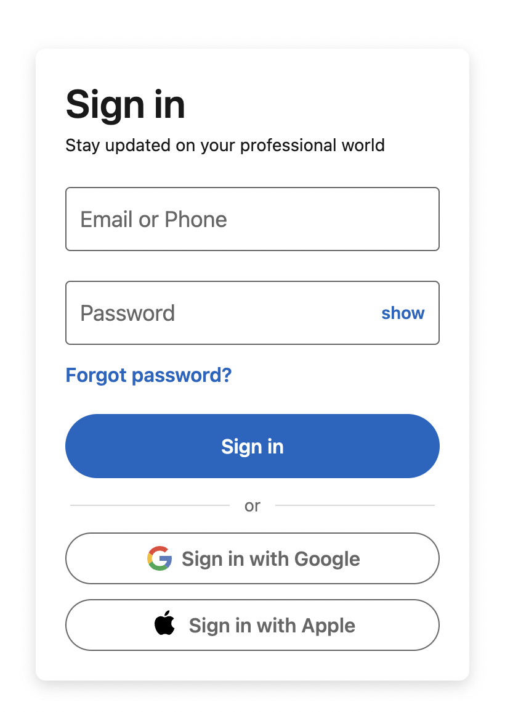

# desafio_11

[[_TOC_]]

# Comenzando 🚀
Para este desafío, es necesario clonar este repositorio en su computadora.

```
git clone git@github.com:larnu-bootcamp/desafio_11.git
```

a partir de la rama main, debes seguir los siguientes pasos:
```
# crear una nueva rama
git checkout -b feature/<tu-usuario-github>

# crear una carpeta con el nombre de tu usuario github
mkdir <tu-usuario-github>

# ir a la carpeta creada
cd <tu-usuario-github>

# crear tu archivo html y css
touch index.html
touch style.css
```

Ahora que tienes los archivos base, debes llegar al siguiente diseño:



